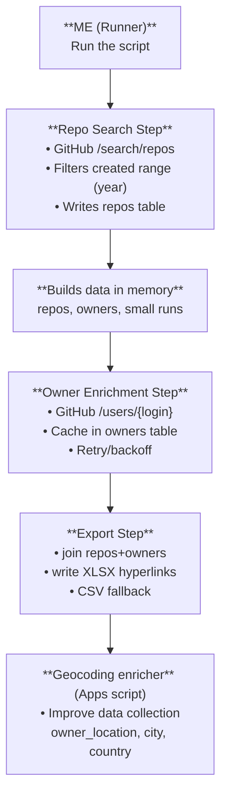

# Coding Sourcer

> Builds a sourcer list of European (or unknown-location) individual GitHub users active in 2024+ on Python repos related to transformers / NLP / RAG / agents, and exports a clean, hyperlink-rich Excel for outreach or analysis.

---

## Architecture

---

## What it searches

**Repositories that:**

- Are written in **Python**
- Match any of the given **topics** (`topic:transformers`, `topic:nlp`, …) or **keywords** in repo name/description/README (“knowledge graph”, “rag”, “agent”, etc.)
- Are **public**, not archived, and **active in 2024+** (`pushed:>=2024-01-01`)

From those repos, it keeps only the **first repo per owner** (to avoid duplicates).

---

## Who it keeps (owner filter)

| Filter | Behavior |
|--------|----------|
| **Owner type** | Only **Users** (not orgs), unless you flip `INCLUDE_ORGS` |
| **Owner location** | Keeps users whose GitHub profile location is: clearly in **Europe** (matches a big list of country/city tokens), or **blank/unknown** (if `KEEP_UNKNOWN_LOCATION=True`). Excludes users whose location clearly indicates non-Europe (e.g. United States, Austin, Vancouver, Beijing, Singapore, etc.) |

---

## What fields it pulls

**From the user profile:**

- `login`
- Complete name (split into first/surname and rejoined)
- `location`
- `html_url` (profile URL)
- `blog` (normalized to a proper URL)
- `bio`
- `email`
- `twitter_username` (turned into a URL)
- LinkedIn URL (first one detected in blog or bio)
- Extra links (any other URLs found in bio)

**From that user’s first matching repository:**

- `repo_name` (full name)
- `repo_url`
- `repo_updated_at` (prefers `pushed_at`, falls back to `updated_at` / `created_at`)
- `repo_description`

---

## Output (Excel)

Writes **`github_users_python_topics.xlsx`** with one row per kept owner.

**Columns:**  
`login`, `complete_name`, `location`, `profile_url`, `repo_name`, `repo_url`, `repo_updated_at`, `repo_description`, `linkedin`, `email`, `twitter`, `blog`, `extra_links`

URL cells are converted into **clickable hyperlinks** with friendly labels (e.g. “GitHub”, “Repo”, “LinkedIn”, “Twitter”, “Website”, “Extra”).

---

## Other important behaviors

- **Rate limits:** If GitHub returns 403 with a reset time, it sleeps until reset and retries.
- **Max results:** Stops after `MAX_REPOS` repos considered (default `500`).
- **Requests paging:** Walks through search result pages (`per_page=100`).
- **Auth:** Uses `GITHUB_TOKEN` env var or `token_1.py`’s `GITHUB_TOKEN_2` if present.
- **Freshness:** Even after search, double-checks repos’ `pushed_at` vs `2024-01-01`.
- **Google Sheets (lisp.py):** Optional. Put `google_service_account.json` (service account key) in the project root; `get_gspread_worksheet()` opens the configured spreadsheet by ID and worksheet by gid. Requires `gspread` and `google-auth`.
- **URL hygiene:** Normalizes URLs, tolerates missing schemes, and extracts links from free text.
