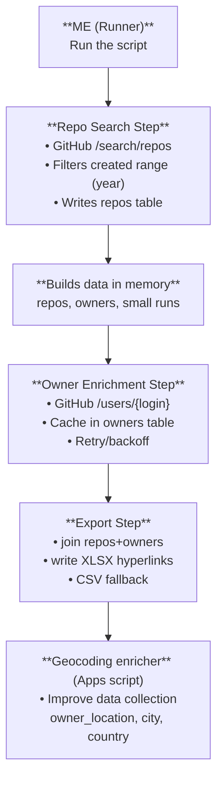

# Coding Sourcer

> Builds a sourcer list of European (or unknown-location) individual GitHub users active in 2024+ on Python repos related to transformers / NLP / RAG / agents, and exports a clean, hyperlink-rich Excel for outreach or analysis.

---

## Architecture

---

## What it searches

**Repositories that:**

- Are written in **Python**
- Match any of the given **topics** (`topic:transformers`, `topic:nlp`, …) or **keywords** in repo name/description/README (“knowledge graph”, “rag”, “agent”, etc.)
- Are **public**, not archived, and **active in 2024+** (`pushed:>=2024-01-01`)

From those repos, it keeps only the **first repo per owner** (to avoid duplicates).

---

## Who it keeps (owner filter)

| Filter | Behavior |
|--------|----------|
| **Owner type** | Only **Users** (not orgs), unless you flip `INCLUDE_ORGS` |
| **Owner location** | Keeps users whose GitHub profile location is: clearly in **Europe** (matches a big list of country/city tokens), or **blank/unknown** (if `KEEP_UNKNOWN_LOCATION=True`). Excludes users whose location clearly indicates non-Europe (e.g. United States, Austin, Vancouver, Beijing, Singapore, etc.) |

---

## What fields it pulls

**From the user profile:**

- `login`
- Complete name (split into first/surname and rejoined)
- `location`
- `html_url` (profile URL)
- `blog` (normalized to a proper URL)
- `bio`
- `email`
- `twitter_username` (turned into a URL)
- LinkedIn URL (first one detected in blog or bio)
- Extra links (any other URLs found in bio)

**From that user’s first matching repository:**

- `repo_name` (full name)
- `repo_url`
- `repo_updated_at` (prefers `pushed_at`, falls back to `updated_at` / `created_at`)
- `repo_description`

---

## Output (Excel)

Writes **`github_users_python_topics.xlsx`** with one row per kept owner.

**Columns:**  
`login`, `complete_name`, `location`, `profile_url`, `repo_name`, `repo_url`, `repo_updated_at`, `repo_description`, `linkedin`, `email`, `twitter`, `blog`, `extra_links`

URL cells are converted into **clickable hyperlinks** with friendly labels (e.g. “GitHub”, “Repo”, “LinkedIn”, “Twitter”, “Website”, “Extra”).

---

## Other important behaviors

- **Rate limits:** If GitHub returns 403 with a reset time, it sleeps until reset and retries.
- **Max results:** Stops after `MAX_REPOS` unique repos (default `500`); each keyword query is capped at `MAX_REPOS_PER_QUERY` (e.g. 40) to avoid flooding.
- **Requests paging:** Walks through search result pages (`per_page=100`).
- **Auth:** Uses `GITHUB_TOKEN` env var or `token_1.py`’s `GITHUB_TOKEN_2` if present.
- **Freshness:** Even after search, double-checks repos’ `pushed_at` vs `2024-01-01`.
- **Google Sheets (NLP.py):** Main output is UPSERT into one sheet (one row per repo). **NLP.py** sources repos by **keyword clusters** (inference_prod, quantization, alignment, peft_lora, vector_database)—one GitHub search query per keyword—with **created** and **pushed** rolling-window scans. Queries use `in:readme in:description` and **exclude** RAG/agent-related terms (e.g. RAG, agent, langchain, llamaindex). Each row includes **skill_cluster**, **keyword_matched**, and **query** (full query string) for traceability. Put `google_service_account.json` in the project root. State uses `last_successful_created_scan_utc` and `last_successful_pushed_scan_utc`; `upsert_rows` dedupes by `repo_full_name`. Optional columns `contributors_top` and `contributors_top_n` are filled only for **new** repos (stars >= MIN_STARS_FOR_CONTRIB; set INCLUDE_CONTRIBUTORS=false to disable).
- **URL hygiene:** Normalizes URLs, tolerates missing schemes, and extracts links from free text.

---

## Fresh run trial (NLP.py)

To confirm new rows are appended to the correct Google Sheet tab with a small, rate-limit–safe run:

1. **Delete `state.json`** in the project root so the next run uses a full first-run window.
2. **Temporary limits** (currently set in NLP.py for trial): `FIRST_RUN_LOOKBACK_DAYS=30`, `MAX_REPOS=80`, `MAX_REPOS_PER_QUERY=10`, `PER_PAGE=50`. Restore to production values (e.g. 62, 500, 40, 100) after the test.
3. Run `python NLP.py`. Console prints **"Writing to worksheet: &lt;title&gt; gid: &lt;id&gt;"** so you can confirm the target tab.
4. In the spreadsheet, search for **test_run_marker** (new column with UTC timestamps on appended rows). New rows are at the bottom; `skill_cluster` and `keyword_matched` should be populated; no duplicate `repo_full_name` rows.
5. **Cleanup (optional):** Remove `test_run_marker` from the header and row dict in NLP.py; restore the config constants above for production.
